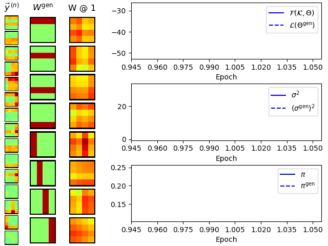

# Standard Bars Test



Bars Test for EBSC for $`H^{gen}=8`$ different bars and $`\pi^{gen}H=2`$ bars on average per image


## Requirements
To run this example, make sure to have completed the installation instructions [described here](/../../README.md) and to have the `evo` environment activated.

```bash
conda activate evo
```


## Get started
To start the experiment, run `python main.py <model>` with `<model>` being one of `ebsc` or `es3c`. To see possible options, run, e.g., 

```bash
$ python main.py ebsc -h           
usage: Standard Bars Test ebsc [-h] [--output_directory OUTPUT_DIRECTORY]
                               [-H H] [--bar_amp BAR_AMP] [--neg_bars]
                               [--no_data_points NO_DATA_POINTS]
                               [--Ksize KSIZE] [--parent_selection {fit,rand}]
                               [--mutation_algorithm {randflip,sparseflip,cross,cross_randflip,cross_sparseflip}]
                               [--no_parents NO_PARENTS]
                               [--no_children NO_CHILDREN]
                               [--no_generations NO_GENERATIONS]
                               [--bitflip_prob BITFLIP_PROB]
                               [--no_epochs NO_EPOCHS] [--viz_every VIZ_EVERY]
                               [--gif_framerate GIF_FRAMERATE]
                               [--pi_gen PI_GEN] [--sigma_gen SIGMA_GEN]

optional arguments:
  -h, --help            show this help message and exit
  --output_directory OUTPUT_DIRECTORY
                        Directory to write training output and visualizations
                        to (default: None)
  -H H                  Number of bars (default: 8)
  --bar_amp BAR_AMP     Bar amplitude (default: 10.0)
  --neg_bars            Whether to randomly make bar amplitudes negative
                        (default: False)
  --no_data_points NO_DATA_POINTS
                        Number of datapoints (default: 500)
  --Ksize KSIZE         Size of the K sets (i.e., S=|K|) (default: 20)
  --parent_selection {fit,rand}
                        Selection operator (default: fit)
  --mutation_algorithm {randflip,sparseflip,cross,cross_randflip,cross_sparseflip}
                        Mutation strategy (default: randflip)
  --no_parents NO_PARENTS
                        Number of parental states to select per generation
                        (default: 10)
  --no_children NO_CHILDREN
                        Number of children to evolve per generation (default:
                        1)
  --no_generations NO_GENERATIONS
                        Number of generations to evolve (default: 1)
  --bitflip_prob BITFLIP_PROB
                        Bitflip probability (only relevant for sparseflip-
                        based mutation algorithms) (default: None)
  --no_epochs NO_EPOCHS
                        Number of epochs to train (default: 40)
  --viz_every VIZ_EVERY
                        Create visualizations every X'th epoch. Set to
                        no_epochs if not specified. (default: 1)
  --gif_framerate GIF_FRAMERATE
                        Frames per second for gif animation (e.g., 2/1 for 2
                        fps). If not specified, no gif will be produced.
                        (default: None)
  --pi_gen PI_GEN       Sparsity used for data generation (defaults to 2/H if
                        not specified) (default: None)
  --sigma_gen SIGMA_GEN
                        Noise level used for data generation (default: 1.0)
```

For distributed execution on multiple CPU cores (requires MPI to be installed), run with `mpirun -n <n_proc> python ...`. For example, to run the EBSC example on four cores, run:

```bash
mpirun -n 4 python main.py ebsc
```


## Reference
[1] "Evolutionary Variational Optimization of Generative Models", Jakob Drefs, Enrico Guiraud, Jörg Lücke. Journal of Machine Learning Research, in press, 2022. Pointer will follow, see [here](https://arxiv.org/abs/2012.12294) for a preliminary arXiv version.