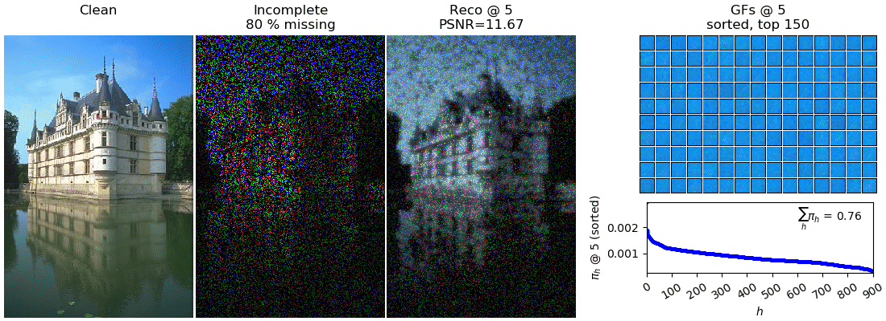

# Image Inpainting with Missing Completely At Random Pixels



ES3C inpainting run on Castle (80% missing; compare [1] for details)


## Requirements
To run this example, make sure to have completed the installation instructions [described here](tvlearn/evo/tree/master/README.md) and to have the `evo` environment activated.

```bash
conda activate evo
```


## Get started
To start the experiment, run `python main.py <model>` with `<model>` being one of `ebsc` or `es3c`. To see possible options, run, e.g.:

```bash
$ python main.py es3c -h           
usage: MCAR Inpainting es3c [-h] [--clean_image CLEAN_IMAGE]
                            [--rescale RESCALE] [--percentage PERCENTAGE]
                            [--patch_height PATCH_HEIGHT]
                            [--patch_width PATCH_WIDTH] [--Ksize KSIZE]
                            [--parent_selection {fit,rand}]
                            [--mutation_algorithm {randflip,sparseflip,cross,cross_randflip,cross_sparseflip}]
                            [--no_parents NO_PARENTS]
                            [--no_children NO_CHILDREN]
                            [--no_generations NO_GENERATIONS]
                            [--bitflip_prob BITFLIP_PROB] [-H H]
                            [--no_epochs NO_EPOCHS]
                            [--merge_every MERGE_EVERY]
                            [--save_theta_all_epochs]
                            [--output_directory OUTPUT_DIRECTORY]
                            [--viz_every VIZ_EVERY]
                            [--gif_framerate GIF_FRAMERATE]

optional arguments:
  -h, --help            show this help message and exit
  --clean_image CLEAN_IMAGE
                        Full path to clean image (png, jpg, ... file)
                        (default: ./img/castle.jpg)
  --rescale RESCALE     If specified, the size of the clean image will be
                        rescaled by this factor (only for demonstration
                        purposes to minimize computational effort) (default:
                        0.1)
  --percentage PERCENTAGE
                        Percentage of missing pixels (default: 10)
  --patch_height PATCH_HEIGHT
                        Patch height (default: 5)
  --patch_width PATCH_WIDTH
                        Patch width (defaults to patch_height if not
                        specified) (default: None)
  --Ksize KSIZE         Size of the K sets (i.e., S=|K|) (default: 20)
  --parent_selection {fit,rand}
                        Selection operator (default: fit)
  --mutation_algorithm {randflip,sparseflip,cross,cross_randflip,cross_sparseflip}
                        Mutation strategy (default: randflip)
  --no_parents NO_PARENTS
                        Number of parental states to select per generation
                        (default: 10)
  --no_children NO_CHILDREN
                        Number of children to evolve per generation (default:
                        1)
  --no_generations NO_GENERATIONS
                        Number of generations to evolve (default: 1)
  --bitflip_prob BITFLIP_PROB
                        Bitflip probability (only relevant for sparseflip-
                        based mutation algorithms) (default: None)
  -H H                  Dictionary size (default: 32)
  --no_epochs NO_EPOCHS
                        Number of epochs to train (default: 50)
  --merge_every MERGE_EVERY
                        Generate reconstructed image by merging image patches
                        every Xth epoch (will be set equal to viz_every if not
                        specified) (default: None)
  --save_theta_all_epochs
                        Whether to append theta at each epoch to H5 training
                        output (otherwise the most recent value will be saved.
                        (default: False)
  --output_directory OUTPUT_DIRECTORY
                        Directory to write H5 training output and
                        visualizations to (will be output/<TIMESTAMP> if not
                        specified) (default: None)
  --viz_every VIZ_EVERY
                        Create visualizations every X'th epoch. Will be set to
                        no_epochs if not specified. (default: 1)
  --gif_framerate GIF_FRAMERATE
                        If specified, the training output will be additionally
                        saved as animated gif. The framerate is given in
                        frames per second. If not specified, no gif will be
                        produced. (default: None)
```

For distributed execution on multiple CPU cores (requires MPI to be installed), run with `mpirun -n <n_proc> python main.py ...`.


__Note__
The default hyperparameters in this examples are chosen s.t. examplary executions of the algorithm on a standard personal computer can be performed in short time. For full resolution images and improved performance, larger models and, in turn, larger compute ressources (on the order of hundreds of CPU cores) are required. For details, see [1]. 


## Reference
[1] "Evolutionary Variational Optimization of Generative Models", Jakob Drefs, Enrico Guiraud, Jörg Lücke. Journal of Machine Learning Research, in press, 2022. Pointer will follow, see [here](https://arxiv.org/abs/2012.12294) for a preliminary arXiv version.
